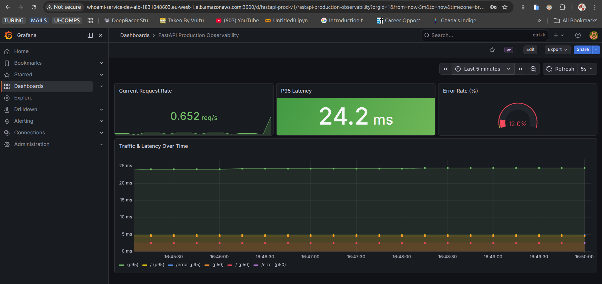
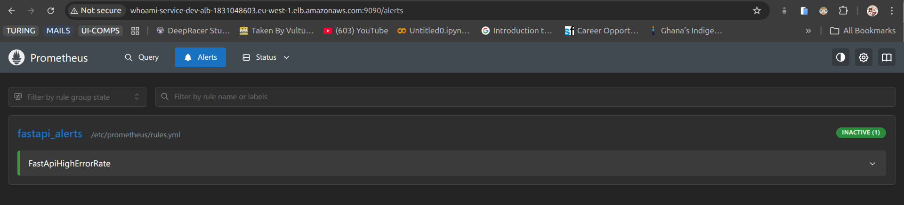
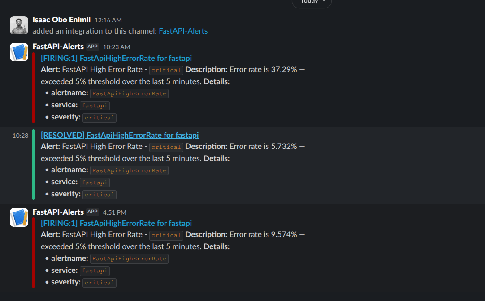
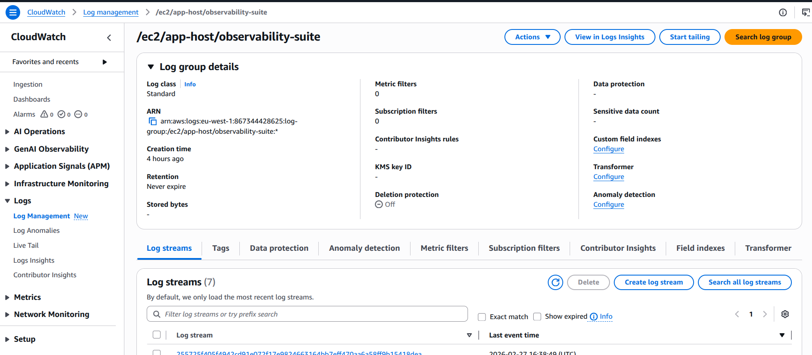
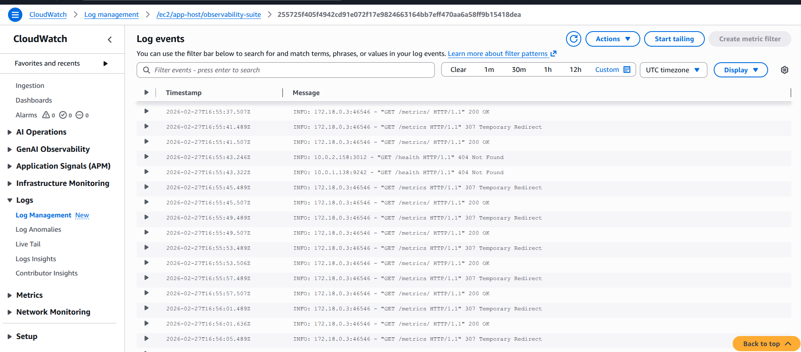

# AWS Security & Observability CI/CD Suite


A comprehensive, production-ready Infrastructure as Code (IaC) and DevSecOps solution. This project provisions a scalable, secure AWS environment utilizing dynamic Jenkins Spot Agents for CI/CD, alongside a complete Observability suite (Prometheus, Grafana, Alertmanager) and centralized Security logging.

## Architecture Overview

The infrastructure is broken down into modular deployment layers:

1.  **CI/CD Layer (Public & Private Subnets)**
    *   **Jenkins Controller**: Resides in a Public Subnet to orchestrate the CI/CD pipeline.
    *   **Jenkins Spot Agents (ASG)**: Dynamic EC2 Spot Instances provisioned on-demand in a Private Subnet (via EC2 Fleet Plugin) to run isolated Docker builds and tests.
    *   **Amazon ECR**: Private container registry for secure storage of application Docker images.
2.  **Application & Observability Layer (Private Subnets)**
    *   **Application Load Balancer (ALB)**: Public-facing entry point routing traffic to internal services securely across defined ports (`80`, `3000`, `9090`, `9093`, `9100`).
    *   **App Compute Host (EC2)**: Runs the application via a unified `docker-compose` stack:
        *   **FastAPI Backend**: Core application service.
        *   **Prometheus**: Scrapes metrics from the API and underlying infrastructure.
        *   **Grafana**: Visualizes metrics centrally.
        *   **Alertmanager**: Triggers notifications for system anomaly thresholds.
        *   **Node Exporter**: Exposes robust system-level hardware and OS metrics.
3.  **AWS Security & Logging Layer (Global/Regional)**
    *   **AWS CloudTrail**: Records automated and manual AWS API call history into an S3 bucket with strict lifecycle policies (30-day IA / 90-day delete).
    *   **AWS GuardDuty**: Intelligent threat detection monitoring the VPC and AWS Account.
    *   **Amazon CloudWatch**: Centralized log aggregation for all containerized applications utilizing the `awslogs` driver.

## Project Structure

```text
.
├── backend/                  # FastAPI Application Source Code & Tests
├── ci-scripts/               # Deployment helper scripts (e.g., deploy.sh)
├── custom-docker-ssh-agent/  # Custom Jenkins Node Dockerfile definitions
├── diagram-engine/           # Python AWS Architecture Diagram generation script
├── infrastructure/           # Terraform IaC configurations & modules
├── monitoring/               # Prometheus, Grafana, & Alertmanager configs
├── Jenkinsfile               # Declarative Jenkins CI/CD pipeline
└── README.md
```

## Technology Stack

*   **Cloud Provider**: Amazon Web Services (AWS)
*   **Infrastructure as Code (IaC)**: Terraform
*   **CI/CD Pipeline**: Jenkins, Jenkins EC2 Fleet Plugin
*   **Containerization**: Docker, Docker Compose, Amazon ECR
*   **Backend framework**: Python, FastAPI
*   **Observability**: Prometheus, Grafana, Alertmanager, Node Exporter
*   **Security & Audit**: AWS CloudTrail, AWS GuardDuty, AWS CloudWatch

## Getting Started

### Prerequisites

Ensure you have the following installed and configured before proceeding:

*   [Terraform](https://developer.hashicorp.com/terraform/install) (v1.5+)
*   [AWS CLI](https://docs.aws.amazon.com/cli/latest/userguide/getting-started-install.html) (Configured with Administrator credentials)
*   [Docker](https://docs.docker.com/get-docker/) & [Docker Compose](https://docs.docker.com/compose/install/)

### 1. Provision Infrastructure (Terraform)

The environment relies heavily on modular Terraform configurations inside the `infrastructure` directory.

```bash
cd infrastructure/
terraform init
terraform plan -out=tfplan
terraform apply "tfplan"
```

*Note: Ensure you update your `terraform.tfvars` file or use a backend configuration file that matches your AWS Account parameters.*

### 2. Configure Jenkins Pipelines

The project pipeline is controlled via the `Jenkinsfile`.
1. Ensure your Jenkins Controller possesses the required EC2 IAM roles for the EC2 Fleet Plugin.
2. Ensure the "SSH Agent" and "Amazon ECR" plugins are installed on Jenkins.
3. Create a new Pipeline job and point it to the Git repository containing this configuration. 

### 3. Deploy the Observability Stack

The CI/CD pipeline automatically pulls code, builds the container, pushes to Amazon ECR, and orchestrates the deployment script (`ci-scripts/deploy.sh`) to spin up the application suite using `docker-compose`.

The backend stack and its dependencies can be executed independently directly on the application host:

```bash
cd monitoring/
docker-compose up -d
```

## Security Posture

*   **Least Privilege IAM Roles**: All instances use tailored service roles for exact permissions.
*   **Private Isolation**: All computational instances (Jenkins Agents, App Host) reside natively in Private Subnets.
*   **CloudTrail Auditing**: Audits are immutable and pushed safely to a secure S3 bucket.
*   **Real-time Threat Detection**: Constantly monitored by AWS GuardDuty.

## Observability Access

Once the Terraform deployment resolves, retrieve your Application Load Balancer DNS from the Terraform outputs. 
Access your tools via the mapped ALB ports:

| Service | Port | Default URL Route |
| :--- | :--- | :--- |
| **Backend API** | `80` | `http://<ALB-DNS>/` |
| **Grafana** | `3000` | `http://<ALB-DNS>:3000` |
| **Prometheus** | `9090` | `http://<ALB-DNS>:9090` |
| **Alertmanager**| `9093` | `http://<ALB-DNS>:9093` |
| **Node Exporter**| `9100` | `http://<ALB-DNS>:9100/metrics` |

*(Note: In a true production environment, it is highly recommended to attach an ACM Certificate to the ALB for secure HTTPS/SSL termination instead of raw ports).*

## Cleanup / Teardown

To avoid incurring unexpected AWS charges, be sure to tear down the environment once testing is concluded:

```bash
cd infrastructure/
terraform destroy -auto-approve
```

## Screenshots & Observability Evidence

The following visual evidence demonstrates the successful deployment and active monitoring of the solution:

### Grafana Dashboard
*Unified dashboard displaying Prometheus metrics, latency, CPU utilization, and more.*


### Prometheus Alerts
*Prometheus alerting UI displaying configured threshold conditions.*


### Alertmanager Triggered Error
*Example of a triggered alert being successfully captured during an anomaly event.*


### CloudWatch Log Stream
*Centralized AWS CloudWatch logging stream output captured from the containerized services.*


### Stream Log Output
*Specific raw cloudwatch log stream snippet detailing application states.*


## Screenshots & Observability Evidence

The following visual evidence demonstrates the successful deployment and active monitoring of the solution:

### Grafana Dashboard
*Unified dashboard displaying Prometheus metrics, latency, CPU utilization, and more.*


### Prometheus Alerts
*Prometheus alerting UI displaying configured threshold conditions.*


### Alertmanager Triggered Error
*Example of a triggered alert being successfully captured during an anomaly event.*


### CloudWatch Log Stream
*Centralized AWS CloudWatch logging stream output captured from the containerized services.*


### Stream Log Output
*Specific raw cloudwatch log stream snippet detailing application states.*

