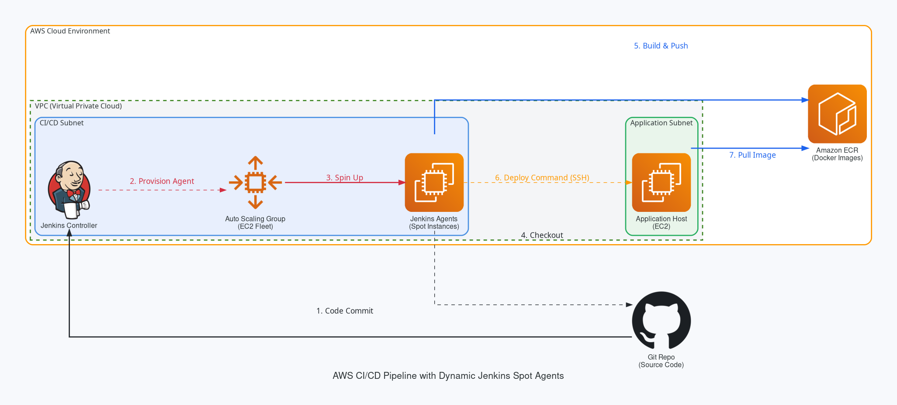

# Jenkins CI/CD with Dynamic EC2 Spot Agents



This project provides a complete infrastructure and CI/CD pipeline setup for Jenkins, focusing on cost-optimization and scalability by utilizing dynamic AWS EC2 Spot instances as Jenkins build agents.

This repository emphasizes the DevOps and Infrastructure-as-Code (IaC) components of the pipeline rather than the backend application itself. The overarching AWS infrastructure (VPC, Jenkins Controller, Auto Scaling Groups, IAM roles, Security Groups) is provisioned dynamically to support this architecture.

## Architecture and Key Features

### Custom Jenkins Agents
Instead of using the master node (controller) or static EC2 instances for builds, this project utilizes custom-built Jenkins agents. These agents are pre-configured with the necessary dependencies (Docker, AWS CLI, `uv`, etc.) required to execute the pipeline efficiently. The custom Dockerfile for this agent image is located in the `custom-docker-ssh-agent-with-deps` directory.

### Dynamic Agents with Spot Instances
To significantly reduce infrastructure costs, the Jenkins agents run as **AWS EC2 Spot Instances**. These instances are dynamically provisioned on-demand when a build is triggered in the pipeline and instances scale down when idle. 

### Essential Jenkins Plugins
This project relies on a few critical Jenkins plugins to orchestrate the dynamic architecture and deployment:

*   **EC2 Fleet Plugin**: This plugin is the core of the dynamic agent architecture. It connects Jenkins to an AWS EC2 Auto Scaling Group (ASG) configured for Spot instances. When the build queue grows, the plugin automatically requests new Spot instances to join as agents. Once builds are complete and instances are idle, it automatically scales them back down, ensuring you only pay for compute when jobs are actually running.
*   **SSH Agent Plugin**: Used securely during the deployment stage (`Deploy to App Host`). This plugin injects SSH credentials loaded in the Jenkins credential store (e.g., `app-host-ssh-key`) directly into the pipeline workspace. This allows secure, passwordless authentication from the Jenkins agent to the remote EC2 application host to trigger the target deployment script (`deploy.sh`) without exposing the private keys in the Jenkinsfile or Docker image.

## Repository Structure

*   **/backend**: Contains the source code, tests, and configuration for the backend application (managed via `uv`).
*   **/ci-scripts**: Contains utility scripts for the deployment phase, such as `deploy.sh`.
*   **/custom-docker-ssh-agent-with-deps**: Contains the `Dockerfile` and build scripts for the custom Jenkins agent image, configuring required runtimes like AWS CLI, Docker, and `uv`.
*   **/infrastructure**: Terraform configuration files for provisioning the complete AWS environment, including the Jenkins Controller, the EC2 Fleet Auto Scaling Group, IAM Roles, Security Groups, and target application hosts.
*   **Jenkinsfile**: The core CI/CD pipeline definition orchestrating build, test, Docker packaging, ECR publishing, and deployment.

## Pipeline Overview

The pipeline (`Jenkinsfile`) is specifically designed to run on these dynamic nodes using the `spot-agents` label:

1.  **Checkout**: Pulls the source code from the repository.
2.  **Install & Test**: Runs necessary tests natively on the dynamically provisioned agent using `uv`.
3.  **Docker Build**: Builds the Dockerized application locally on the agent.
4.  **Push Image to ECR**: Authenticates the Docker daemon via the node's IAM role and pushes the image to AWS ECR.
5.  **Deploy to App Host**: Dynamically discovers the private IP of the running application host, connects via the SSH Agent plugin, and executes the remote `deploy.sh` script to pull and run the latest image.

## Prerequisites

*   **AWS CLI**: Configured with sufficient administrative privileges to deploy the infrastructure.
*   **Terraform**: Version 1.x or higher installed.
*   **Docker**: Required locally if you intend to test or modify the Jenkins agent image before deployment.
*   An active AWS Account.

## Provisioning Infrastructure

The environment uses Terraform for end-to-to-end Infrastructure-as-Code delivery.

1.  Navigate to the `infrastructure` directory:
    ```bash
    cd infrastructure
    ```
2.  Initialize the Terraform workspace:
    ```bash
    terraform init
    ```
3.  Review the execution plan:
    ```bash
    terraform plan
    ```
4.  Apply the configuration:
    ```bash
    terraform apply
    ```
    *Note: Retain the output variables provided upon successful apply, as you will need the EC2 Fleet ID and instance IPs for Jenkins configuration and testing.*

## Build Custom Jenkins Agent Image

After the infrastructure is provisioned, you must build and push the custom Jenkins agent Docker image so that the Spot instances can use it.

1.  Navigate to the custom image directory (from the project root):
    ```bash
    cd custom-docker-ssh-agent-with-deps
    ```
2.  Run the build and push script:
    ```bash
    ./build-and-push.sh
    ```
    *Note: Ensure your AWS CLI is configured and authenticated before running the script so it can push the image to ECR.*

## Configuring Jenkins

Before running the pipeline, you must configure Jenkins to utilize the new infrastructure:

1.  **Plugins**: Ensure the `EC2 Fleet Plugin`, `SSH Agent Plugin`, and `Docker Pipeline` plugins are installed on the Jenkins Controller.
2.  **EC2 Fleet IAM Permissions**: The EC2 Fleet plugin requires specific permissions to provision and terminate Spot instances dynamically. The Jenkins Controller's IAM role (`jenkins_role`) must be granted the following permissions:
    *   **EC2 Actions**: 
        *   `ec2:DescribeSpotFleetInstances`
        *   `ec2:ModifySpotFleetRequest`
        *   `ec2:CreateTags`
        *   `ec2:DescribeRegions`
        *   `ec2:DescribeInstances`
        *   `ec2:DescribeInstanceStatus`
        *   `ec2:DescribeSpotFleetRequests`
        *   `ec2:DescribeFleets`
        *   `ec2:DescribeFleetInstances`
        *   `ec2:ModifyFleet`
        *   `ec2:DescribeInstanceTypes`
        *   `ec2:TerminateInstances`
        *   `ec2:DescribeTags`
    *   **Auto Scaling Actions**: 
        *   `autoscaling:DescribeAutoScalingGroups`
        *   `autoscaling:TerminateInstanceInAutoScalingGroup`
        *   `autoscaling:UpdateAutoScalingGroup`
    *   **IAM Actions**: 
        *   `iam:ListInstanceProfiles`
        *   `iam:ListRoles`
        *   `iam:PassRole` (limited to `ec2.amazonaws.com` and `ec2.amazonaws.com.cn`)
    *(Note: These permissions are automatically provisioned if utilizing the included Terraform infrastructure code.)*
3.  **Credentials**: 
    *   Create a Jenkins Credential of type **SSH Username with private key** with the ID `app-host-ssh-key`.
    *   Provide `ec2-user` as the username and securely inject the private key generated for the Application Host (`whoami-service-dev-key`).
4.  **EC2 Fleet setup**: Add a new cloud under Manage Nodes and Clouds. Use the Auto Scaling Group ID provided by the Terraform output, and assign it the label `spot-agents`. 

## Executing the Pipeline

1.  Create a new Pipeline job in Jenkins.
2.  Point the Pipeline definition to this repository and specify the `Jenkinsfile` path.
3.  Trigger a build. The EC2 Fleet plugin will automatically provision a new Spot instance if none are available, execute the pipeline steps, deploy the application to the App Host, and subsequently terminate the agent after an idle timeout.

## Clean Up

To avoid ongoing AWS charges, ensure you destroy the infrastructure when your testing or deployment is complete.

1.  Navigate to the `infrastructure` directory.
2.  Run the destroy command:
    ```bash
    terraform destroy
    ```
3.  Confirm the destruction prompt. Ensure no manual resources were created outside Terraform that could prevent a clean tear down.
